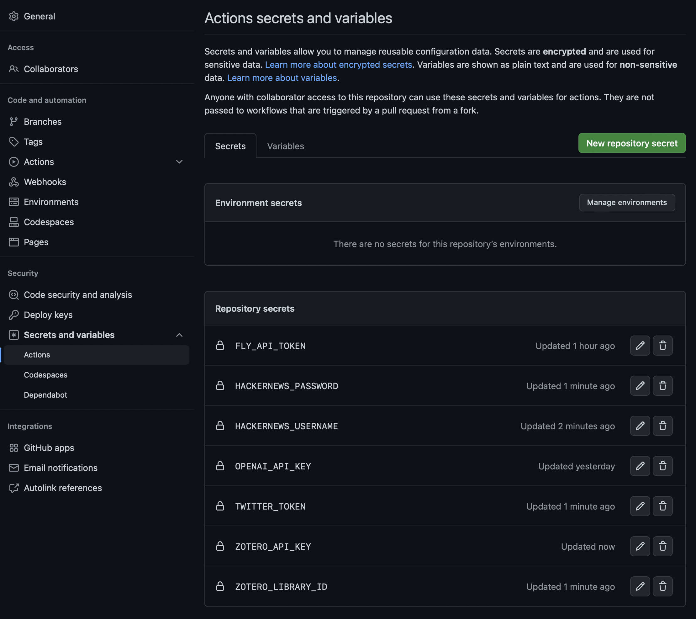
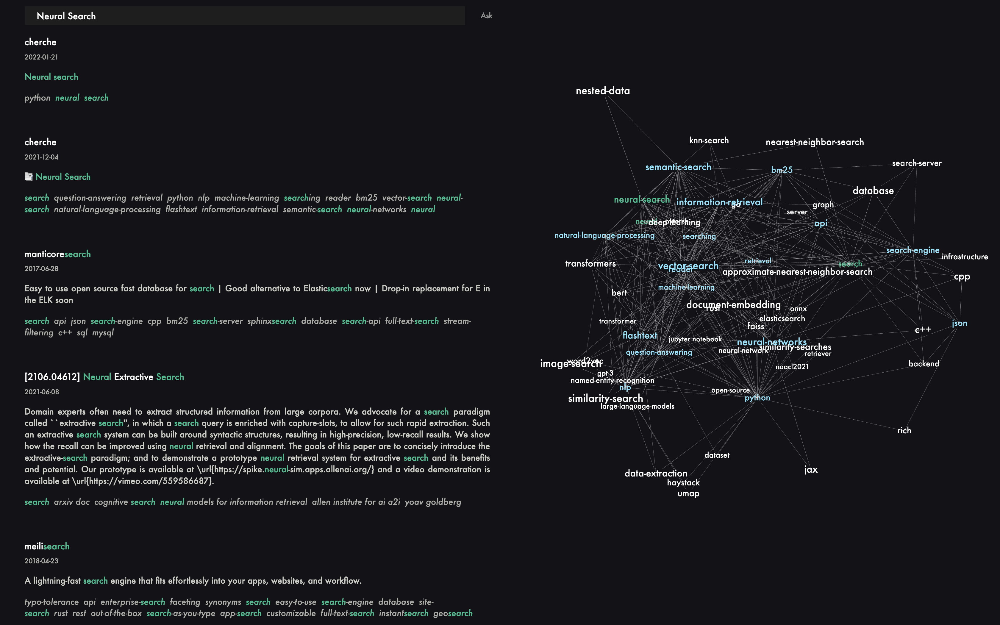
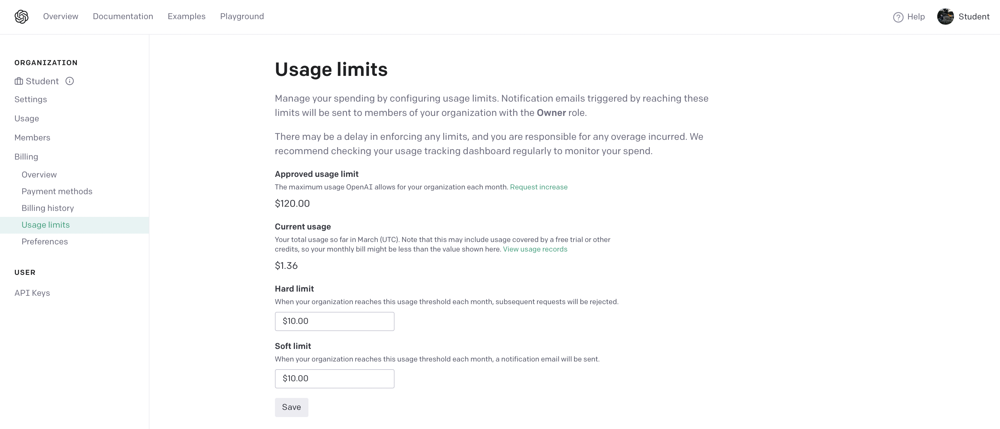

<div align="center">
  <h1>Conflux</h1>
  <pre>Unified Personal Search Engine</pre>
</div>
<br>

**Conflux** is a powerful web application that acts as your unified personal search engine, seamlessly integrating and indexing your interactions across multiple platforms into a cohesive and searchable knowledge base. By aggregating data from sources like GitHub, Twitter, HackerNews, and Zotero, Conflux constructs a personalized search experience coupled with an interactive knowledge graph, enabling you to navigate through your collected content and automatically extracted tags effortlessly.


---

## Features

- **Unified Search Across Platforms**: Consolidate your favorite content from GitHub stars, Twitter likes, HackerNews upvotes, and Zotero records into one searchable interface.
- **Interactive Knowledge Graph**: Visualize connections between topics, tags, and documents through an auto-generated knowledge graph.
- **Automated Content Extraction**: Schedule automatic updates to keep your knowledge base current with your latest interactions.
- **Advanced Tagging System**: Enhance searchability with auto-extracted tags and the ability to navigate through related concepts.
- **AI-Enhanced Search (Optional)**: Integrate with OpenAI's GPT for advanced query understanding and document re-ranking.

## How It Works

Conflux operates by leveraging API integrations to fetch and process your data:

1. **Data Extraction**: A dedicated GitHub Action workflow runs twice daily to extract:
   - **GitHub**: Your starred repositories.
   - **Twitter**: Tweets you've liked.
   - **HackerNews**: Posts you've upvoted.
   - **Zotero**: Your saved documents.

2. **Data Processing**: The extracted content is processed to generate:
   - A **search index** for efficient querying.
   - A **knowledge graph** representing the relationships between tags and documents.
   - Automated **tag extraction** to enhance search and navigation.

3. **Deployment**: The updated application is deployed automatically:
   - **Backend API**: Hosted on Fly.io for handling search queries and data retrieval.
   - **Frontend**: Updated GitHub Pages site for the user interface.

## Getting Started

### Prerequisites

- **Programming Knowledge**: Familiarity with Python and Docker is beneficial.
- **Accounts and API Access**:
  - GitHub account
  - Twitter Developer account
  - HackerNews account
  - Zotero account
  - (Optional) OpenAI account
- **Tools**:
  - [Git](https://git-scm.com/)
  - [Python 3.10+](https://www.python.org/downloads/)
  - [Docker](https://www.docker.com/get-started) and [Docker Compose](https://docs.docker.com/compose/)

### Installation

1. **Fork and Clone the Repository**

   ```sh
   git clone https://github.com/BellaZ0317/Conflux.git
   cd Conflux
   ```

2. **Install Python Dependencies**

   ```sh
   pip install --upgrade pip
   pip install -r requirements.txt
   ```

   Alternatively, use Docker:

   ```sh
   docker build -t conflux .
   ```

## Usage

To run Conflux locally:

1. **Set Up Environment Variables**: Configure your API keys and secrets as per the [Configuration](#configuration) section.

2. **Run the Data Extraction Script**:

   ```sh
   python run.py
   ```

   This script fetches data from your configured sources and prepares the knowledge base.

3. **Launch the Application**:

   ```sh
   make launch
   ```

   This command uses Docker to start the backend API.

4. **Access the Frontend**: Open `docs/index.html` in your web browser to interact with your personal search engine.

## Configuration

Conflux requires setting up API integrations for the platforms you wish to aggregate data from.

### API Integration

- **GitHub**: No additional configuration needed if public repositories are used.
- **Twitter**: Requires a Bearer token from the Twitter Developer Portal.
- **HackerNews**: Uses your username and password to fetch upvoted posts.
- **Zotero**: Requires an API key and library ID.

### Secrets Management

Secrets should be stored securely as environment variables or in your repository's secrets if deploying via GitHub Actions.

#### Environment Variables

- **Fly.io**:
  - `FLY_API_TOKEN`: API token for deploying to Fly.io.
- **OpenAI** (Optional):
  - `OPENAI_API_KEY`: API key for OpenAI services.
- **Twitter**:
  - `TWITTER_TOKEN`: Bearer token from the Twitter Developer Portal.
- **Zotero**:
  - `ZOTERO_API_KEY`: API key from Zotero.
  - `ZOTERO_LIBRARY_ID`: Your Zotero library ID.
- **HackerNews**:
  - `HACKERNEWS_USERNAME`: Your HackerNews username.
  - `HACKERNEWS_PASSWORD`: Your HackerNews password.

#### Repository Secrets

If using GitHub Actions, add these secrets in your repository settings under **Secrets** > **Actions**.



## Knowledge Graph Visualization

Conflux generates an interactive knowledge graph that helps you visualize the relationships between different topics and documents.

- **Nodes** represent tags and topics.
- **Edges** represent the connections between them based on your interactions.



## Costs and Considerations

- **Hosting**: The application can be hosted on Fly.io with costs starting under `$8` per month. Costs may increase with higher usage.
- **OpenAI API**: If using the AI features, set spending limits in your OpenAI account to control costs.

  

- **Resource Limits**: Configure resource limits in `fly.toml` to prevent unexpected charges.

  ```toml
  [services.concurrency]
    hard_limit = 6
    soft_limit = 3
    type = "connections"
  ```

  

## Contributing

Contributions are welcome! Please read the [Contributing Guidelines](CONTRIBUTING.md) for detailed information on how to contribute to the project.

## License

This project is licensed under the **MIT License** - see the [LICENSE](LICENSE) file for details.

## Deployment

For detailed deployment instructions, please refer to the [Deployment Guide](DEPLOYMENT.md).
